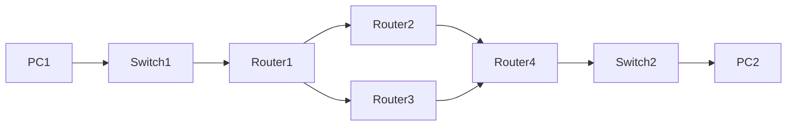

# Networking

*A bunch of notes about networking concepts*

## Table of content

- [TCP/IP Stack](#tcp-ip-stack)
- [IP Addresses](#ip-addresses)
    - [IPv4 Classes](#ipv4-classes)
    - [Special IPv4 Addresses](#special-ipv4-addresses)
    - [Subnet Mask](#subnet-mask)
    - [CIDR](#cidr)
    - [Subnetting](#subnetting)
- [Packet Tracer](#packet-tracer)
    - [Configuration](#configuration)

<br>

### TCP-IP Stack

<br>

#### Data Link Layer (Second Layer)
- Data link is second layer, operates on MAC addresses and defines comunication between devices inside local network
- PDO is called frame and consists of header and trailer
- Header contains source and destination MAC address and type of the layer above (ipv4, ipv6)
- Trailer contains 4 bytes for CRC (Cyclic Reduncancy Check)
- Switch is layer 2 device
- One of the protocols that operate on this layer is ARP (Address resolution protocol)
- ARP is used to discover MAC addresses of device with known layer 3 IP address
- ARP request is broadcast, and we wait for correct device to reply
- Broadcast is indicated by putting FFFF.FFFF.FFFF as a destination MAC address
- ARP reply is unicast, and its destination is host that sent ARP request
#### Network (Third Layer)
- Provides connectivity between hosts on different networks
- Provides logical addressing (IP)
- Provides path selection between source and destination
- Routers operate on this layer

<br>

### IP Addresses

<br>

#### IPv4 Classes

| Class | Public IP Range | Mask | Private IP Range |
| ----- | --------------- |----- | ---------------- |
| A | 1.0.0.0 - 126.255.255.255 | 255.0.0.0 | 10.0.0.0 - 10.255.255.255 |
| B | 128.0.0.0 - 191.255.255.255 | 255.255.0.0 | 172.16.0.0 to 172.31.255.255 |
| C | 192.0.0.0 - 223.255.255.255 | 255.255.255.0 | 192.168.0.0 to 192.168.255.255 |
| D | 224.0.0.0 - 239.255.255.255 | Multicast, no mask |  |
| E | 240.0.0.0 - 255.255.255.255 | Reserved, no mask |  |

<br>

#### Special IPv4 Addresses


| Class | Name | IP | Description |
| ----- | ---- | -- |  ---------- |
| A | Local Loopback Address  | 127.0.0.0 - 127.255.255.255 | Packets sent are looped through the network interface card only. Localhost. |
| A | Default Network Address  | 0.0.0.0 - 0.255.255.255 | Addresses are reserved for default network |
|  | Broadcast Address  | x.x.255.255 | Send data to all devices. Host portion has all binary ones. Disabled by default |
| E | Local Broadcast Address  | 255.255.255.255 | Send data to all devices on local network. Always dropped by routers by default |
| B | Link Local Address  | 169.254.0.0 - 169.254.255.255 | Valid only for communications within the subnetwork. Most often are assigned automatically. Allow 2 computers to communicate when DHCP servers are not available. |

<br>

#### Subnet Mask

- Used to determine network and host portion of an address
- Check if device is local or remote
- For address 10.1.1.1/16, network portion is 10.1 and host portion is 1.1.
- For address 10.1.1.1/24, network portion is 10.1.1 and host portion is 1.
- Devices 10.1.1.1 and 10.1.2.1 belong to same subnet if mask is /16. If mask is /24 then devices are on different subnet

#### CIDR

- Classless Inter-Domain Routing
- Replaces classful IP addresses
- Variable length subnet mask allows more flexibility
- Example: 10.0.0.0/20 (network is 20 bits, 12 bits is reserved for hosts)

#### Subnetting

###### Basic information

```rust
// Example 1
// Host portion of address is represented in binary

Ip         = 192.168.1.18/24
Subnet     = 192.168.1.00000000 = 192.168.1.0 
First_host = 192.168.1.00000001 = 192.168.1.1 
Last_host  = 192.168.1.11111110 = 192.168.1.254 
Broadcast  = 192.168.1.11111111 = 192.168.1.255 

```
```rust
// Example 2
// Network and host portion of address are split by "_"
// Host and split portion of address are represented in binary

Ip         = 172.16.35.123/20 = 172.16.0010_0011.01111011
Subnet     = 172.16.0010_0000.00000000 = 172.16.32.0
First_host = 172.16.0010_0000.00000001 = 172.16.32.1
Last_host  = 172.16.0010_1111.11111110 = 172.16.47.254 
Broadcast  = 172.16.0010_1111.11111111 = 172.16.47.255 

```
```rust
// Example 3
// Network and host portion of address are split by "_"
// Host and split portion of address are represented in binary

Ip         = 172.16.129.1/17 = 172.16.1_0000001.01111011
Subnet     = 172.16.1_0000000.00000000 = 172.16.128.0
First_host = 172.16.1_0000000.00000001 = 172.16.128.1
Last_host  = 172.16.1_1111111.11111110 = 172.16.255.254 
Broadcast  = 172.16.1_1111111.11111111 = 172.16.25547.255 

```
###### Subdividing subnet

- Includes "stealing" bits from host portion of an address
- Allocating "stolen" bits to network portion of a new address
- This creates multiple subnets from existing subnet
- Determine number of hosts with formula: hosts <= 2^n - 2
- n is number of bits required
- Minus 2 is for broadcast (all ones) network address (all zeros)
- Network address has host portion of all zeros and can't assigned to a host
- Count host bits from right to left
- Determine number of networks with formula: networks <= 2^n
- Count network bits from left to right

```rust
// Example 1
// Given subnet 10.1.1.0/24, split it into smaller subnets each containing 14 machines

Subnet_= 10.1.1.0/24 = 10.1.1.00000000
Network = 10.1.1
Host = 0

// We need number of hosts so we use:
// hosts <= 2^n - 2  
// 14 <= 2^n - 2 => 14 <= 2^4 - 2 => 14 <= 14
// This means that 4 bits will support 14 hosts, which is what we need
// We count host bits from right to left
// Rest of the bits will belong to network portion of an address
// We only need 4 bits for hosts, remaining 4 bits that previousley belong to host
// will now belong to network portion
// We need to calculate new mask, which is 28

New_subnet = 10.1.1.0000_0000/28

// We created multiple networks from existing subnet, each containing 16 addresses,
// but 2 are reserved for subnet and broadcast

First_network  = 10.1.1.0000_0000 = 10.1.1.0/28 
Second_network = 10.1.1.0001_0000 = 10.1.1.16/28 
Third_network  = 10.1.1.0010_0000 = 10.1.1.32/28 
Fourth_network = 10.1.1.0011_0000 = 10.1.1.48/28 
Last_network   = 10.1.1.1111_0000 = 10.1.1.240/28 

```

```rust
// Example 2
// Given subnet 10.128.192.0/18, split it into 30 smaller subnets with as many host as possible
Subnet = 10.128.192.0/18 = 10.128.11_00000.00000000

// To get number of networks we use:
// networks <= 2^n
// 30 <= 2^5 => 30 <= 32
// We need to "steal" 5 bits from host poriton of an address and allocate it to network portion
// We count network bits from left to right and calculate new mask, which is 18 + 5 = 23

New_Subnet     = 10.128.1100000_0.00000000

First_network  = 10.128.1100000_0.00000000 = 10.128.192.0/23
Second_network = 10.128.1100001_0.00000000 = 10.128.194.0/23
Third_network  = 10.128.1100010_0.00000000 = 10.128.196.0/23
Fourth_network = 10.128.1100011_0.00000000 = 10.128.198.0/23
Last_network   = 10.128.1111111_0.00000000 = 10.128.254.0/23 

```
<br>

### Packet Tracer

<br>

##### Useful commands

```sh
# Configure Router
# Default mode is user mode, denoted by ">"
# To see all available commands in current mode, run $?
$enable # go to privileged mode. Denoted by "#"
$show ip interface brief # see all interfaces
$configure terminal # go to global config mode. Denoted by (config)#
$interface gigabitEthernet 0/0/0 # configure interface 0/0/0 mode
$ip address 10.1.1.1 255.255.255.0 # configure ip and mask

# Router interfaces have shutdown command applied by default,
# they will be in administratively down/down state by default
$no shutdown # enable interface
$exit # back to global config mode
$hostname R1 # set hostname
$end # back to privileged mode
$copy running-config startup-config # save config or just use wr

# Static routes
$show ip route # show routers routing table
$ip route 192.168.3.0 255.255.255.0 192.168.13.3 # set ip route

# Configure Switch
$en # go to privileged mode
$conf t # go to global config mode
$ip default-gateway 192.168.1.62 255.255.255.192 
$host S1 # set host name
$interface vlan 1 # configure vlan interface
$no shut # enable
$ip address 192.168.1.61 255.255.255.192
$exit # back to global config mode
$end # back to privileged mode
$wr # save config with short wr
# Switch notes:
# Switch interfaces do not have shutdown command applied by default,
# they will be in up/up state if connected to other device or in
# down/down state if not connected to other device

#Interfaces
$show intefaces status
# Switch commands
# To view MAC address table use (from privileged mode)
# SW1#show mac address-table
# To clear MAC address table use (from privileged mode)
# SW1#clear mac address-table dynamic
```

<br>

### Routing

<br>

##### Routing Table

- Routers store information about destinations they know in routing table
- Routing table is set of instructions for router telling it where to forward the packet
- When routers receive packet they pick most specific route and forward the packet
- If there is no entry in routing table, packet is dropped
- If the destination is directly connected (Connected Route) then packet is send directly to that destination
- If the destination is routers own addres (Local Route) then router will consume the packet
- When we configure routers interface and enable it, 2 routers are automatically added to routing table
- Connected Route (C letter in routing table)
- If interface ip is 192.168.1.1/24 then connected route will be whole subnet 192.168.1.0/24
- Local Route (L letter in routing table)
- If interface ip is 192.168.1.1/24 then local route will be 192.168.1.1/32

##### Static routes

```sh
# From global config mode
$ip route ip-address netmask next-hop
$ip route ip-address netmask exit-interface
$ip route ip-address netmask exit-interface next-hop
```

##### Default route

```sh
# From global config mode
$ip route 0.0.0.0 0.0.0.0 ip-address
```

<br>

### Life of a Packet

<br>


<br>

If we want to send request from PC1 to PC2 following things need to happen:
- Since PC1 and PC2 are not in the same subnet, PC1 sends an ARP requet to learn MAC address of its default gateway (Router 1 is configured to be default gateway of PC1)
- Request is a broadcast with fileds:
```sh
    srcIpAddress: "ip of PC1"
    destIpAddress: "ip of Router1"
    srcMacAddress: "mac of PC1"
    destMacAddress: ffff.ffff.ffff # all ones because its broadcast
```
- Switch1 will flud request on all ports, and it will be discarded by everyone in local network except for Router1
- Router 1 will respond with unicast request to PC1 with fields:
```sh
    srcIpAddress: "ip of Router1"
    destIpAddress: "ip of PC1"
    srcMacAddress: "mac of Router1"
    destMacAddress: "mac address of PC1"
```
- During these communications Switch1 will learn MAC addresses of both PC1 and Router1
- Now that PC1 knows MAC address of its default gateway, it will send request to Router1 with following fields:
```sh
    srcIpAddress: "ip of PC1"
    destIpAddress: "ip of PC2"
    srcMacAddress: "mac of PC1"
    destMacAddress: "mac address of Router1"
```
- Router1 receives request, removes ethernet header and looks at destination IP in its routing table
- It finds out that next hop is Router1
- Since Router1 doesn't know MAC address of Router2, it again needs to use ARP protocol and sends following packet to Router2
```sh
    srcIpAddress: "ip of Router1"
    destIpAddress: "ip of Router2"
    srcMacAddress: "mac of Router1"
    destMacAddress: ffff.ffff.ffff # all ones because its broadcast 
```
- Router2 will receive it and send back an unicast request to Router1 (with its own MAC address same as explained before).
- Now that Router1 knows MAC address of Router2 it replaces destination MAC address in original request and send it to Router2:
```sh
    srcIpAddress: "ip of PC1"
    destIpAddress: "ip of PC2"
    srcMacAddress: "mac of Router1"
    destMacAddress: "mac of Router2" 
```
- Router2 does the same thins as Router1 before
- It finds out, from its routing table, that next hop is Router4
- Since it doesn't know Router's 4 MAC address it has to use ARP
- After receiving ARP response forwards the packet to Router4
- After Router4 receives packet it removes ethernet headers and look for destination in its routing table
- Since destination is directly connected to one of its interfaces, it will forward this packet to destination PC2
- However, Router4 does now know the MAC address of PC2 so it again has to use APR, similar to first communication between PC1 and Router1
- Now that Router4 knows MAC address of PC2 it will deliver original packet to it:
```sh
    srcIpAddress: "ip of PC1"
    destIpAddress: "ip of PC2"
    srcMacAddress: "mac of Router4"
    destMacAddress: "mac of PC2" 
```
- Packet is delivered from PC1 to PC2
- Important thing is that at layer 3 (IP layer) source and destination IP addresses never changed during the trip
- Only thing that changed were MAC addresses of all hops
- If we want to imediately send request back from PC2 to PC2, we won't need to do any ARP requests since all MAC addreses were resolved on previous request

