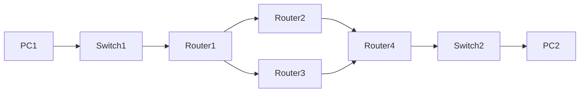

# Networking

*A bunch of notes about networking concepts*

## Table of content

- [TCP/IP Stack](#tcp-ip-stack)
- [IP Addresses](#ip-addresses)
    - [IPv4 Classes](#ipv4-classes)
    - [Special IPv4 Addresses](#special-ipv4-addresses)
    - [Subnet Mask](#subnet-mask)
    - [CIDR](#cidr)
    - [Subnetting](#subnetting)
- [Packet Tracer](#packet-tracer)
    - [Configuration](#configuration)

<br>

### TCP-IP Stack

<br>

#### Data Link Layer (Second Layer)
- Data link is second layer, operates on MAC addresses and defines comunication between devices inside local network
- PDO is called frame and consists of header and trailer
- Header contains source and destination MAC address and type of the layer above (ipv4, ipv6)
- Trailer contains 4 bytes for CRC (Cyclic Reduncancy Check)
- Switch is layer 2 device
- One of the protocols that operate on this layer is ARP (Address resolution protocol)
- ARP is used to discover MAC addresses of device with known layer 3 IP address
- ARP request is broadcast, and we wait for correct device to reply
- Broadcast is indicated by putting FFFF.FFFF.FFFF as a destination MAC address
- ARP reply is unicast, and its destination is host that sent ARP request

```rust
// Check ARP table
$arp -a

```
#### Network (Third Layer)
- Provides connectivity between hosts on different networks
- Provides logical addressing (IP)
- Provides path selection between source and destination
- Routers operate on this layer

<br>

### IP Addresses

<br>

#### IPv4 Classes

| Class | Public IP Range | Mask | Private IP Range |
| ----- | --------------- |----- | ---------------- |
| A | 1.0.0.0 - 126.255.255.255 | 255.0.0.0 | 10.0.0.0 - 10.255.255.255 |
| B | 128.0.0.0 - 191.255.255.255 | 255.255.0.0 | 172.16.0.0 to 172.31.255.255 |
| C | 192.0.0.0 - 223.255.255.255 | 255.255.255.0 | 192.168.0.0 to 192.168.255.255 |
| D | 224.0.0.0 - 239.255.255.255 | Multicast, no mask |  |
| E | 240.0.0.0 - 255.255.255.255 | Reserved, no mask |  |

<br>

#### Special IPv4 Addresses


| Class | Name | IP | Description |
| ----- | ---- | -- |  ---------- |
| A | Local Loopback Address  | 127.0.0.0 - 127.255.255.255 | Packets sent are looped through the network interface card only. Localhost. |
| A | Default Network Address  | 0.0.0.0 - 0.255.255.255 | Addresses are reserved for default network |
|  | Broadcast Address  | x.x.255.255 | Send data to all devices. Host portion has all binary ones. Disabled by default |
| E | Local Broadcast Address  | 255.255.255.255 | Send data to all devices on local network. Always dropped by routers by default |
| B | Link Local Address  | 169.254.0.0 - 169.254.255.255 | Valid only for communications within the subnetwork. Most often are assigned automatically. Allow 2 computers to communicate when DHCP servers are not available. |

<br>

#### Subnet Mask

- Used to determine network and host portion of an address
- Check if device is local or remote
- For address 10.1.1.1/16, network portion is 10.1 and host portion is 1.1.
- For address 10.1.1.1/24, network portion is 10.1.1 and host portion is 1.
- Devices 10.1.1.1 and 10.1.2.1 belong to same subnet if mask is /16. If mask is /24 then devices are on different subnet

#### CIDR

- Classless Inter-Domain Routing
- Replaces classful IP addresses
- Variable length subnet mask allows more flexibility
- Example: 10.0.0.0/20 (network is 20 bits, 12 bits is reserved for hosts)

#### Subnetting

###### Basic information

```rust
// Example 1
// Host portion of address is represented in binary

Ip         = 192.168.1.18/24
Subnet     = 192.168.1.00000000 = 192.168.1.0 
First_host = 192.168.1.00000001 = 192.168.1.1 
Last_host  = 192.168.1.11111110 = 192.168.1.254 
Broadcast  = 192.168.1.11111111 = 192.168.1.255 

```
```rust
// Example 2
// Network and host portion of address are split by "_"
// Host and split portion of address are represented in binary

Ip         = 172.16.35.123/20 = 172.16.0010_0011.01111011
Subnet     = 172.16.0010_0000.00000000 = 172.16.32.0
First_host = 172.16.0010_0000.00000001 = 172.16.32.1
Last_host  = 172.16.0010_1111.11111110 = 172.16.47.254 
Broadcast  = 172.16.0010_1111.11111111 = 172.16.47.255 

```
```rust
// Example 3
// Network and host portion of address are split by "_"
// Host and split portion of address are represented in binary

Ip         = 172.16.129.1/17 = 172.16.1_0000001.01111011
Subnet     = 172.16.1_0000000.00000000 = 172.16.128.0
First_host = 172.16.1_0000000.00000001 = 172.16.128.1
Last_host  = 172.16.1_1111111.11111110 = 172.16.255.254 
Broadcast  = 172.16.1_1111111.11111111 = 172.16.25547.255 

```
###### Subdividing subnet

- Includes "stealing" bits from host portion of an address
- Allocating "stolen" bits to network portion of a new address
- This creates multiple subnets from existing subnet
- Determine number of hosts with formula: hosts <= 2^n - 2
- n is number of bits required
- Minus 2 is for broadcast (all ones) network address (all zeros)
- Network address has host portion of all zeros and can't assigned to a host
- Count host bits from right to left
- Determine number of networks with formula: networks <= 2^n
- Count network bits from left to right

```rust
// Example 1
// Given subnet 10.1.1.0/24, split it into smaller subnets each containing 14 machines

Subnet_= 10.1.1.0/24 = 10.1.1.00000000
Network = 10.1.1
Host = 0

// We need number of hosts so we use:
// hosts <= 2^n - 2  
// 14 <= 2^n - 2 => 14 <= 2^4 - 2 => 14 <= 14
// This means that 4 bits will support 14 hosts, which is what we need
// We count host bits from right to left
// Rest of the bits will belong to network portion of an address
// We only need 4 bits for hosts, remaining 4 bits that previousley belong to host
// will now belong to network portion
// We need to calculate new mask, which is 28

New_subnet = 10.1.1.0000_0000/28

// We created multiple networks from existing subnet, each containing 16 addresses,
// but 2 are reserved for subnet and broadcast

First_network  = 10.1.1.0000_0000 = 10.1.1.0/28 
Second_network = 10.1.1.0001_0000 = 10.1.1.16/28 
Third_network  = 10.1.1.0010_0000 = 10.1.1.32/28 
Fourth_network = 10.1.1.0011_0000 = 10.1.1.48/28 
Last_network   = 10.1.1.1111_0000 = 10.1.1.240/28 

```

```rust
// Example 2
// Given subnet 10.128.192.0/18, split it into 30 smaller subnets with as many host as possible
Subnet = 10.128.192.0/18 = 10.128.11_00000.00000000

// To get number of networks we use:
// networks <= 2^n
// 30 <= 2^5 => 30 <= 32
// We need to "steal" 5 bits from host poriton of an address and allocate it to network portion
// We count network bits from left to right and calculate new mask, which is 18 + 5 = 23

New_Subnet     = 10.128.1100000_0.00000000

First_network  = 10.128.1100000_0.00000000 = 10.128.192.0/23
Second_network = 10.128.1100001_0.00000000 = 10.128.194.0/23
Third_network  = 10.128.1100010_0.00000000 = 10.128.196.0/23
Fourth_network = 10.128.1100011_0.00000000 = 10.128.198.0/23
Last_network   = 10.128.1111111_0.00000000 = 10.128.254.0/23 

```
<br>

#### IPv6 Classes

##### Global unicast addresses

- Must register to use them. Because they are public addresses, its expected that they are unique
- **Originaly defined as 2000:/3 (2000 to 3FFF:FFFF:FFFF:FFFF:FFFF:FFFF:FFFF:FFFF)**
- Now defined as as all addresses that are not reserved for other purposes

```rust
    2001:0DB8:8B00:0001:0000:0000:0000:0001/64
    2001:0DB8:8B00 # 48-bit global routing prefix, assigned by the ISP
    0001 # 16-bit subnet identifier, used by enterprises to make various subnets
    # global routing prefix and subnet identifier together make up IPv6 network prefix

    0000:0000:0000:0001 # 64-bit interface identifier, host portion of the address
    # host portion can be manually configured or generated from MAC address using EUI-64
```

##### Unique local addresses

- Unique local IPv6 addresses are private addresses which can not be used over the internet
- They dont have to be registered. They can be used freely within internal networks
- They don't need to be globaly unique (we should still try to make them unique)
- Can't be routed over internet (routers will drop packets)
- **Defined as FC00::7 (FC00:: to FDFF:FFFF:FFFF:FFFF:FFFF:FFFF:FFFF:FFFF)**
- However, later update requires that 8th bit is set to 1, so the first 2 digits must be **FD**

```rust
    FD45:93AC:8A8F:0001:0000:0000:0000:0001/64
    FD # 2-bit indicating that address is unique local address
    45:93AC:8A8F # 40-bit global ID, which should be randomly generated
    # global ID should be unique so that addresses dont overlap when companies merge
    0001 # 16-bit subnet identifier
    # these first 64-bits make up network indentifier

    0000:0000:0000:0001 # 64-bit interface identifier, host portion of the address
    # host portion can be manually configured or generated from MAC address using EUI-64
```

##### Link local addresses

- Link-local IPv6 addresses are automatically generated on IPv6 enabled interfaces
- Link-local means that these addresses are used for communication within single link (subnet)
- Routers will not route packets with link-local destination IPv6 address
- Use command "$ipv6 enable" to enable IPv6 addresses on interface
- **Defined as FE80::/10 (FE80:: to FEBF:FFFF:FFFF:FFFF:FFFF:FFFF:FFFF:FFFF)**
- However, the standard states that 54 bits after FE80/10 should all be 0, so we wont see link-local addresses begining with FE9, FEA or FEB. Only FE8
- The interface ID is generated using EU-64 rules
- Common uses are: routing protocol peering, next-hop address for static routes, Neighbor Discovery Protocol (IPv6 replacement for ARP)

##### Multicast addresses

- **IPv6 uses range FF00::/8 for multicast (FF00:: to FFFF:FFFF:FFFF:FFFF:FFFF:FFFF:FFFF:FFFF)**
- IPv6 does not use broadcast (There is no broadcast address in IPv6)
- Its possible to send message to all hosts in subnet using multicast
- Important mulitcast addresses
```rust
    FF02::1 # To all nodes/hosts, functions like broadcast (IPv4 equivalent is 224.0.0.1)
    FF02::2 # To all routers (IPv4 equivalent is 224.0.0.2)
    FF02::5 # To all OSPF routers (IPv4 equivalent is 224.0.0.5)
    FF02::6 # To all OSPF DRs/BDRs (IPv4 equivalent is 224.0.0.6)
    FF02::9 # To all RIP routers (IPv4 equivalent is 224.0.0.9)
    FF02::A # To all EIGRP routers (IPv4 equivalent is 224.0.0.10)
```

##### Other IPv6 addresses

- Anycast
- :: = Unspecified IPv6 address (IPv4 equivalent is 0.0.0.0)
- ::1 = Loopback addressk (IPv4 equivalent is 127.0.0.0/8)


### Packet Tracer

<br>

##### Useful commands

```sh
# Configure Router
# Default mode is user mode, denoted by ">"
# To see all available commands in current mode, run $?
$enable # go to privileged mode. Denoted by "#"
$show ip interface brief # see all interfaces
$configure terminal # go to global config mode. Denoted by (config)#
$interface gigabitEthernet 0/0/0 # configure interface 0/0/0 mode
$ip address 10.1.1.1 255.255.255.0 # configure ip and mask

# Router interfaces have shutdown command applied by default,
# they will be in administratively down/down state by default
$no shutdown # enable interface
$exit # back to global config mode
$hostname R1 # set hostname
$end # back to privileged mode
$copy running-config startup-config # save config or just use wr

# Static routes
$show ip route # show routers routing table
$ip route 192.168.3.0 255.255.255.0 192.168.13.3 # set ip route

# Configure Switch
$en # go to privileged mode
$conf t # go to global config mode
$ip default-gateway 192.168.1.62 255.255.255.192 
$host S1 # set host name
$interface vlan 1 # configure vlan interface
$no shut # enable
$ip address 192.168.1.61 255.255.255.192
$exit # back to global config mode
$end # back to privileged mode
$wr # save config with short wr
# Switch notes:
# Switch interfaces do not have shutdown command applied by default,
# they will be in up/up state if connected to other device or in
# down/down state if not connected to other device

#Interfaces
$show intefaces status
# Switch commands
# To view MAC address table use (from privileged mode)
# SW1#show mac address-table
# To clear MAC address table use (from privileged mode)
# SW1#clear mac address-table dynamic
```

<br>

### Routing

<br>

##### Routing Table

- Routers store information about destinations they know in routing table
- Routing table is set of instructions for router telling it where to forward the packet
- When routers receive packet they pick most specific route and forward the packet
- If there is no entry in routing table, packet is dropped
- If the destination is directly connected (Connected Route) then packet is send directly to that destination
- If the destination is routers own addres (Local Route) then router will consume the packet
- When we configure routers interface and enable it, 2 routers are automatically added to routing table
- Connected Route (C letter in routing table)
- If interface ip is 192.168.1.1/24 then connected route will be whole subnet 192.168.1.0/24
- Local Route (L letter in routing table)
- If interface ip is 192.168.1.1/24 then local route will be 192.168.1.1/32

##### Static routes

```sh
# From global config mode
$ip route ip-address netmask next-hop
$ip route ip-address netmask exit-interface
$ip route ip-address netmask exit-interface next-hop
```

##### Default route

```sh
# From global config mode
$ip route 0.0.0.0 0.0.0.0 ip-address
```

<br>

### Life of a Packet

<br>


<br>

If we want to send request from PC1 to PC2 following things need to happen:
- Since PC1 and PC2 are not in the same subnet, PC1 sends an ARP requet to learn MAC address of its default gateway (Router 1 is configured to be default gateway of PC1)
- Request is a broadcast with fileds:
```sh
    srcIpAddress: "ip of PC1"
    destIpAddress: "ip of Router1"
    srcMacAddress: "mac of PC1"
    destMacAddress: ffff.ffff.ffff # all ones because its broadcast
```
- Switch1 will flud request on all ports, and it will be discarded by everyone in local network except for Router1
- Router 1 will respond with unicast request to PC1 with fields:
```sh
    srcIpAddress: "ip of Router1"
    destIpAddress: "ip of PC1"
    srcMacAddress: "mac of Router1"
    destMacAddress: "mac address of PC1"
```
- During these communications Switch1 will learn MAC addresses of both PC1 and Router1
- Now that PC1 knows MAC address of its default gateway, it will send request to Router1 with following fields:
```sh
    srcIpAddress: "ip of PC1"
    destIpAddress: "ip of PC2"
    srcMacAddress: "mac of PC1"
    destMacAddress: "mac address of Router1"
```
- Router1 receives request, removes ethernet header and looks at destination IP in its routing table
- It finds out that next hop is Router1
- Since Router1 doesn't know MAC address of Router2, it again needs to use ARP protocol and sends following packet to Router2
```sh
    srcIpAddress: "ip of Router1"
    destIpAddress: "ip of Router2"
    srcMacAddress: "mac of Router1"
    destMacAddress: ffff.ffff.ffff # all ones because its broadcast 
```
- Router2 will receive it and send back an unicast request to Router1 (with its own MAC address same as explained before).
- Now that Router1 knows MAC address of Router2 it replaces destination MAC address in original request and send it to Router2:
```sh
    srcIpAddress: "ip of PC1"
    destIpAddress: "ip of PC2"
    srcMacAddress: "mac of Router1"
    destMacAddress: "mac of Router2" 
```
- Router2 does the same thing as Router1 before
- It finds out, from its routing table, that next hop is Router4
- Since it doesn't know Router's 4 MAC address it has to use ARP
- After receiving ARP response forwards the packet to Router4
- After Router4 receives packet it removes ethernet headers and look for destination in its routing table
- Since destination is directly connected to one of its interfaces, it will forward this packet to destination PC2
- However, Router4 does now know the MAC address of PC2 so it again has to use APR, similar to first communication between PC1 and Router1
- Now that Router4 knows MAC address of PC2 it will deliver original packet to it:
```sh
    srcIpAddress: "ip of PC1"
    destIpAddress: "ip of PC2"
    srcMacAddress: "mac of Router4"
    destMacAddress: "mac of PC2" 
```
- Packet is delivered from PC1 to PC2
- Important thing is that at layer 3 (IP layer) source and destination IP addresses never changed during the trip
- Only thing that changed were MAC addresses of all hops
- If we want to imediately send request back from PC2 to PC2, we won't need to do any ARP requests since all MAC addreses were resolved on previous request


### VLAN

<br>

- VLANs are configured on switch on per-interface basis
- They logically separate end hosts at Layer 2
- Although hosts are physically connected to the same switch (and are in same broadcast domain) we use VLANs to logically separate them
- Switches do not forward traffic directly between VLANs
- If we don't configure VLANs, all interfaces are in VLAN 1 (default)

#### Access ports

- Using the “Switchport mode access” command forces the port to be an access port while and any device plugged into this port will only be able to communicate with other devices that are in the same VLAN
- Access ports are part of only one VLAN and normally used for terminating end devices likes PC, Laptop and printer
- By default, an access port carries only one VLAN

```sh
    $show vlan brief

    $interface range g1/0 - 3
    $switchport mode access
    $switchport access vlan 10
    # % Access VLAN does not exist. Creating VLAN 10
    $do show vlan brief
    # To change name
    $vlan 10
    $name NEW_VLAN_NAME
```

#### Trunk ports

- A trunk port can carry traffic in one or more VLANs on the same physical link.
- Trunk ports differentiate VLANs by either adding a tag to the packet (802.1Q) or encapsulation the packet (ISL)
- Trunk ports are used for switch-switch or switch-router communication
- By default, a trunk interface can carry traffic for all VLANs

```sh
    $switchport trunk encapsulation ?
    $switchport trunk encapsulation dot1q
    $switchport mode trunk
    $show interfaces trunk
    $switchport trunk allowed vlan ?
    $switchport trunk allowed vlan 10,30 # example
    $switchport trunk native vlan 1001 # set up default vlan on trunk
    $do show interface trunk # see trunk config
```

#### Router On a Stick (ROAS)

- Used for inter-VLAN routing with only one physical interface (G0/0.10, G0/0.20, G0/0.30 ...)
- In other words, its used to route between multiple VLANs using a single interface on router and switch
- Switch interface is configured as regular trunk
- Router is configured using subinterfaces. We configure the VLAN tag and IP address on each subinterface

```sh
    $interface g0/0
    $no shutdown # make sure interface is enabled
    $interface g0/0.10 # subinterface number does not have to match VLAN number, but its recommended
    $enacapsulation dot1q 10 # if frame tagged with VLAN 10 arrives, router will behave as it arrived on interface g0/0.10, it will also tag all frames leaving g0/0.10 with VLAN 10 using dot1q
    $ip address 192.168.1.62 255.255.255.192 # assign ip address to subinterface
```

#### Inter VLAN routing via SVI (Switch Virtual Interfce)

```sh
    $ip routing # enables Layer 3 routing on a switch
    $interface g0/1
    $no switchport # this configures port to be "routed port" (Layer 3 port, not Layer 2/switchport)
    $ip routing # enable routing on switch
    $ip address 192.168.1.193 255.255.255.252 # assign ip to our port
    $ip route 0.0.0.0 0.0.0.0 192.168.1.194 # set default route to Router to allow traffic out of network
    $do show ip route
```


### Spaning Tree Protocol (STP)

#### Notes

- Layer 2 protocol
- It enables redundant Layer 2 networks
- STP prevents Layer 2 loops by placing redundant ports into blocking state (essentialy disabling the interface)
- By selecting which ports are forwarding and which ports are blocking, STP creates a single path to/from each point in the network
- STP message unit is called Bridge Protocol Data Unit (BPDU)
- STP enabled switches send/receive Hello BPDUs out of all interfaces. Default timer is 2 sec
- If switch receives Hello BPDU on an interface, it knows that interface is connected to another switch because PCs, routers etc. dont use STP (they dont send BPDUs)

- There is a set process that STP uses to determine which ports hould be forwarding and which should be blocking
- Switches use one field in BPDU, the Bridge ID field, to elect root bridge for network (Bridge is an old term, this is really a Switch ID)
- Switch with lowest Bridge ID becomes a root Bridge
- Bridge ID consistas of 2 fields: Brige Priority and MAC address. Default Bridge Priority is set to 32768, so root bridge becomes bridge with lowest MAC address.
- Cisco devices contain VLAN id in Bridge ID field so they use version of STP called PVST (Per-VLN Spanning Tree)
- ALL ports on root bridge are put in FORWARDING state (they send data)
- Other switches in topology must have a path to reach root bridge
- When switch is powered on, it assumes it is the root bridge
- It will only give up its position if it receives "superior" BPDU (lower Bridge ID)
- Once topology has converged, and switches agree on root bridge, only the root bridge sends BPDUs


#### Algorithm

- The switch with lowest Bridge ID is elected as root bridge. All ports on root brige are DESIGNATED PORTS (forwardin state)
- Each remaining switch will select ONE of its interfaces to be root port. Interface with lowest ROOT COST will be root port (If ports have same cost, lowest neighbor Bridge ID is used, if Bridge ID is same, neoghbors Port ID is used). Root ports are also in forwarding state. ROOT COST depends on interface speed and follows this logic: 10Mbps - 100, 100Mbps - 19, 1Gbps - 4, 10Gbps - 2. Root brige has cost 0 on all interfaces
- Each remaining collision domain will select ONE interface to be designated port (forwarding state). The other port in collision domain will be non-designated (blocking). Designated port selection: interface on switch with lowest root cost, if tie, we use lowest Bridge Id.


### Rapid Spaning Tree Protocol

- Rapid Spaning Tree Protocol is not timer based algorith like 802.1D. Therefore, RSTP offers improvement over 30 sec or more that 802.1D takes to move a link to forwarding.
- The heart of protocol is the new bridge-bridge handshake mechanism which allows ports to move to forwarding directly.

#### Similarities between STP and RSTP

- RSTP serves the same purpose as STP, blocking specific ports to prevent Layer 2 loops
- RSTP elects root bridge using same rules as STP
- RSTP elects root ports with the same rules as STP
- RSTP elects designated ports with the same rules as STP


### Dynamic Routing

- IGP (Interior Gateway Protocol)
- EGP (External Gateway Protocol)
- IGP is used to share routes inside single organization
- EGP is usedto share routes between different autonomous systems
- Only EGP algorithm used in modern is Path Vector (Border Gateway Protocol)
- EGP uses 2 algorithms: Distance Vector (earlier) and Link State
- There are 2 Distance Vector protocols: Routing Information Protocol (RIP) and Enhanced Interior Gateway Routing Protocol (EIGRP)
- There are 2 Link State protocols: Open Shortest Path First (**OSPF**) and Intermediate System to Intermediate System (IS-IS)
- If router using dynamic routing protocol learns two different routes to the same destination, it will use **metric** value of the routes to determine which is best.
- Lower metric is better
- Each routing protocol uses different metric to determine which route is the best
- If metric is the same, traffic will be load balanced over both routes (Equal Cost Multi-Path - ECMP)
- Companies use only one IGP, usually OSPF or EIGRP, but if 2 protocols are used than we cant compare them and we have to pick only one 
- The Administraive Distance (AD) is used to determine which routing protocol is prefered
- A lower AD is preferred and indicates that routing protocol is more "trustworthy" (more likely to select a good route)
- ADs: directly connected (0), static (1), External BGP (20), EIGRP (90), IGRP (100), OSPF (110), IS-IS (115), RIP (120), unusable route (255)
- Metric is only used if AD is the same
- Floating Static Route is static route that has preconfigured AD to be higher that AD of default dynamic routing protocol

#### Distance Vector Protocols

- Routing Information Protocol (RIP)
- Enhanced Interior Gateway Routing Protocol (EIGRP)
- Distance Vector protocols operate by sending following information to their neighbors:
- their known nestination networks
- their metrics to reach their known destination networs
- This method of routing information is often called: "routing by rumor"
- This is because router doesn't know about the networks beyond its neighbors. It only knows about information their neigbors tell it.

#### Link State Protocols

- Open Shortest Path First (**OSPF**)
- Intermediate System to Intermediate System (IS-IS)
- When using Link State routing protocol, every router creates a "connectiviry map" of the network. This map is the same on all routers.
- To allow this, each router advertises information about its interfaces (connected networks) to its neighbors.
- These advertisements are passed along to other routers unitl all routers in network develop the same map of the network
- Each router independently uses this map to calculate best routes to each detination
- Link state protocols tend to be faster in reacting to network changes than distance vector protocols, but they use more resources on router

### RIP

- Routing Information Protocol 
- Uses hop count as its metrics. One router = one hop (bandwith i irrelevant)
- Maximum hop cout in 15. Anything above that is considered unreachabale
- It can not be used in large networks


### OSPF

- Based on Shortest Path First algorithm of Edsger Dijsktra 
- There are 3 versions of OSPF: v1 (1989) - no logner in use, v2 (1998) for IPv4, v3 (2008) for IPv6 (can be used for IPv4 as well, but for that v2 is more common)
- OSPF and other link state protocols create a "connectiviry map" of the network
- Routers store information about the network in LSAs (Link State Advertisements), which are organized in structure called LSDB (Link State Database)
- Routers will flood LSAs until all routers in OSPF develop the same map of the network (LSDB)
- The cost of each link is calculated based on bandwith
- The total metric is the total cost of each link in the route 

##### OSPF AREA

- OSP uses areas to divide the network. Small networks can be one area without negative effects on performance
- Area is set of routers that share the same LSDB
- The backbone area (area 0) is an area all other areas must connect to
- Routers with interfaces in same area are called internal routers
- Routers with interfaces in multiple areas are called area border routers (ABRs)
- ARBs maintain LSDBs for each area they are connected too. Its not recommended to connect ARBs to more than 2 areas (to not overburden the router)
- Routers connected to backbone area are called backbone routers
- An intra-area route is a route to a destination inside the same OSPF are
- An inter-area route is a route to a destination in different OSPF area
- OSPF areas should be contigues (each individual area should be connected, and not divided up)
- All OSPF areas must have at least one ABR connected to the backbone area
- OSPF interfaces in the same subnet must be in the same area


### First Hop Redundancy Protocols

- FHRP is a computer networking protocol which is designed to protect the default gateway used on subnetwork by allowing two or more routers to provide backup for that address.
- In the event of failure of an active router, the backup router will take over the address, usually within a few seconds.
- The name First Hop is used because default gateway is the first hop to a destination outside network
- Two routers share VIP (Virtual IP address), and negotiate which one will be ACTIVE and which one STAND BY router by sending multicast hello messages
- We configure PCs to use VIP as their default gateway
- When PCs want to send message outside of network, it will encapsulate VIP packet header, but since it doesn't know the destination MAC address of ACTIVE router, it will send ARP to learn it
- Both routers will receive ARP, but only ACTIVE router will send ARP reply with VIRTUAL MAC address inside it
- When ACTIVE router goes down, STAND BY router will figure it out since it wont receive any hello messages. It will send GRATUITOUS ARP (this ARP is sent without request) replies to all switched to update their MAC tables.
- If router returns it will take STAND BY role
- Host Standby Router Protocol (HSRP) is Cisco proprietery FHRP protocol
- Virtual Router Redundancy Protocol (VRRP) is open standard protocol
- Gateway Load Balancing Protocol (GLBP)

### Access Control List (ACL)

- ACL is list of rules on router (in global config mode) used to filter traffic
- This list is ordered sequence of ACEs (Access Control Entries)
- After creation, ACL have to be applied to an interface
- ACLs are applied inbound or outbound
- When router checks a packet against the ACL, it processes ACEs in order, from top to bottom
- **A maximum of one ACL can be applied to a single interface per direction (2 ACLs per interface in total)**
- **I packet doesn't match any ACE in ACL it will be dropped (Implicit deny)**

#### Standard ACL

- Match based on Source IP Address only
- Standard Numbered ACL
- Standard Named ACL
- Standard ACLs should be applied as close to destination as possible

#### Extended ACL

- Match based on Srouce/Destination IP, Source/Destination Port, etc
- Extended Numbered ACL
- Extended Named ACL
- Standard ACLs are more specific and they should be applied as close to source as possible


### Network Time Protocol (NTP)

- All devices have an internal clock (routers, swithes, PCs)
- The internal hardware clock of a device will drift over time, so its not ideal time source
- NTP allowes for automatic syncing of time over a network
- NTP uses UDP port 123 to communicate


### Dynamic Host Configuration Protocol (DHCP)

- DHCP is used to allow hosts to automatically/dynamically learn various aspects of their network configuration such as IP address, subnet mask, default gateway, DNS server etc. without manual configuration
- DHCP is used mainly to configure end hosts, while routers, switches etc need manual configuration to function properly
- In small networks router usually acts as DHCP server for hosts in the LAN
- In larger networks, DHCP server is usually Windows/Linux server
- DHCP servers use port UDP 67
- DHCP clients use port UDP 68
```sh
# On Windows
$ipconfig /all
```

### Simple Network Management Protocol (SNMP)
